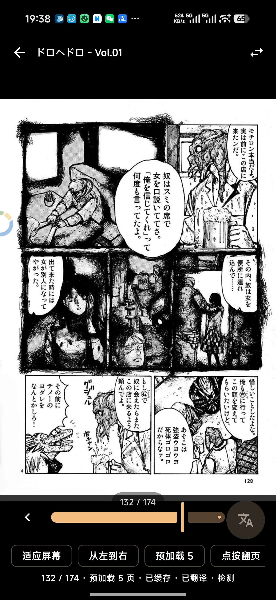
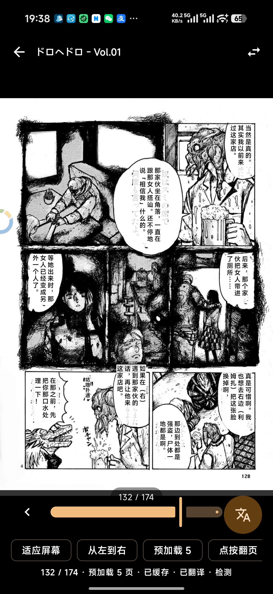

<p align="center">
  
</p>

<p align="center">
  <a href="README.md">简体中文</a> | English
</p>

# Komgarot

Komgarot is an Android comic reader client for Komga servers, built with Kotlin and Jetpack Compose.

> Feel free to suggest features in the issues. I don't use every part of Komga, so I probably won't have considered adding them yet.

## Features

- Sign in to a Komga server
- Browse libraries, series, collections, and read lists
- Series search, author search, sorting, and filters
- Book detail pages with metadata viewing and editing
- Paged reading, vertical scroll reading, reading direction, page fit, and progress seeking
- AI translation
- Long-press page actions: save, share, set as book cover, or set as series cover
- Incognito reading, app lock, and keep-screen-on mode
- Admin entry for libraries, users, server settings, maintenance, and activity

## Screenshots

<p>
  
  
  
  
  
  
  
</p>

## AI Translation
> This feature requires your own OpenAI-compatible AI service and a vision-capable model.
>
> Generation speed and quality vary by model. Some model providers may apply stricter policies to sensitive content and fail to return translations, so choose a provider that fits your needs.
>
> For speed and quality, AI translation sends one request per text segment with the dialogue text and the full image. Translating one image may consume a large number of tokens. My personal average is 2000+ tokens per request.

### Translation Preview
<p>
  
  
  
  
</p>
<p>
  
  
  
  
</p>

## Requirements

- Android 11+
- A reachable Komga server
- JDK 11+
- Android Studio or a Gradle command-line environment

## Build

Debug APK:

```powershell
.\gradlew.bat :app:assembleDebug
```

Unit tests:

```powershell
.\gradlew.bat testDebugUnitTest
```

Lint:

```powershell
.\gradlew.bat :app:lintDebug
```

Release APK:

```powershell
.\gradlew.bat :app:assembleRelease
```

Debug output:

```text
app/build/outputs/apk/debug/
```

## Stack

- Kotlin
- Jetpack Compose
- Material 3
- Navigation Compose
- Retrofit + Gson
- OkHttp
- Coil
- DataStore Preferences
- AndroidX Security Crypto
- AndroidX Biometric

## Links
[LINUX DO](https://linux.do)
