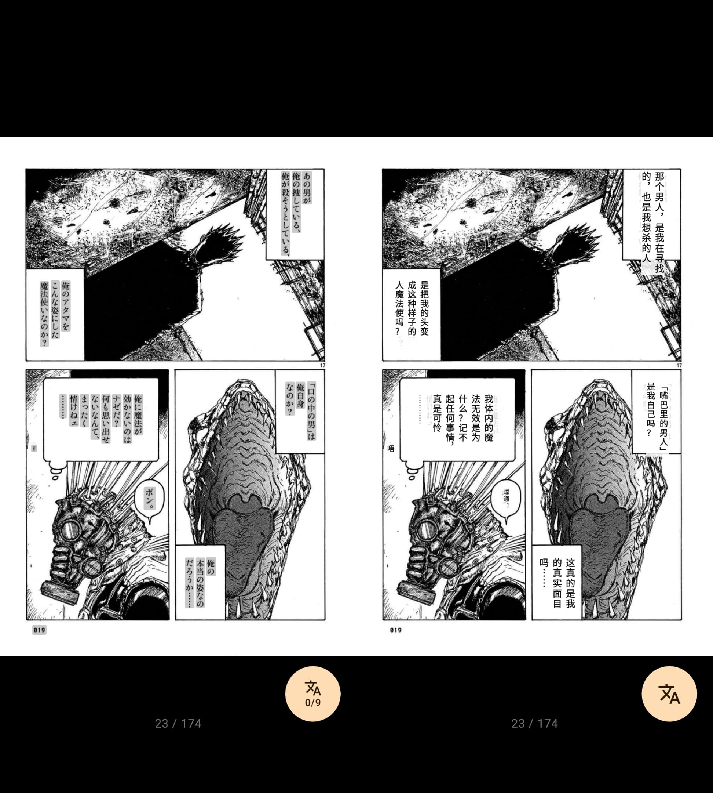
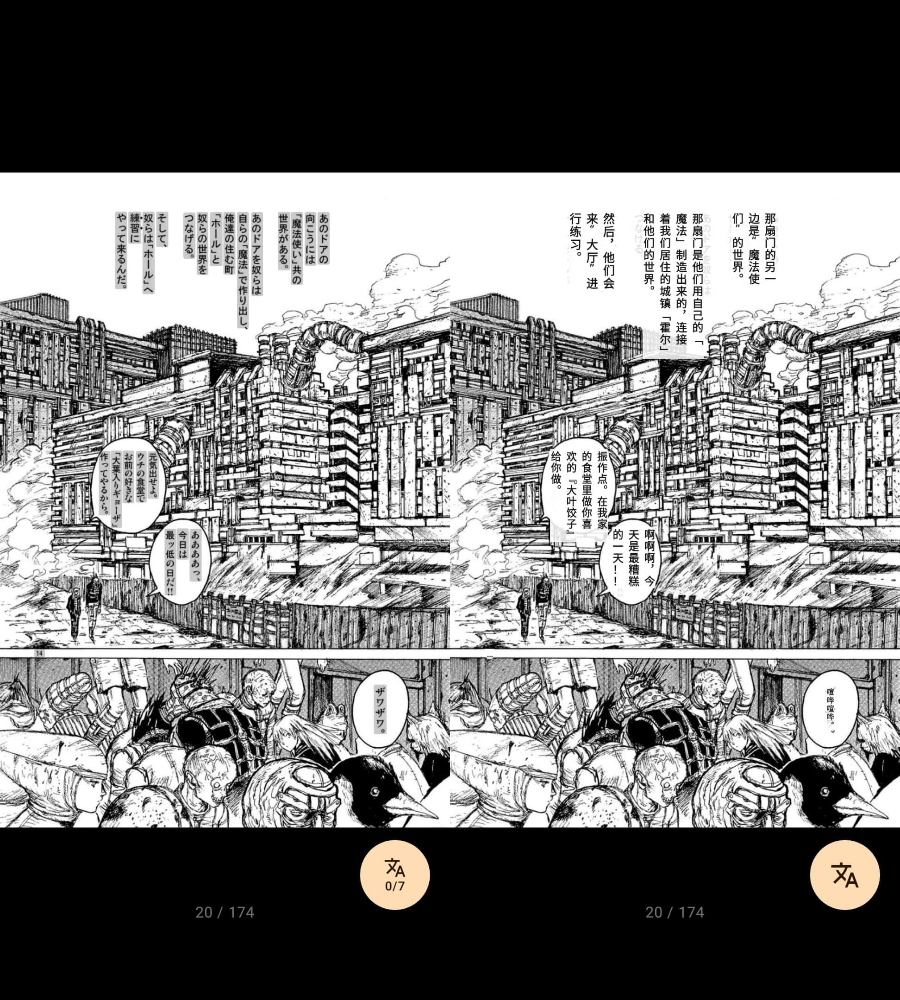
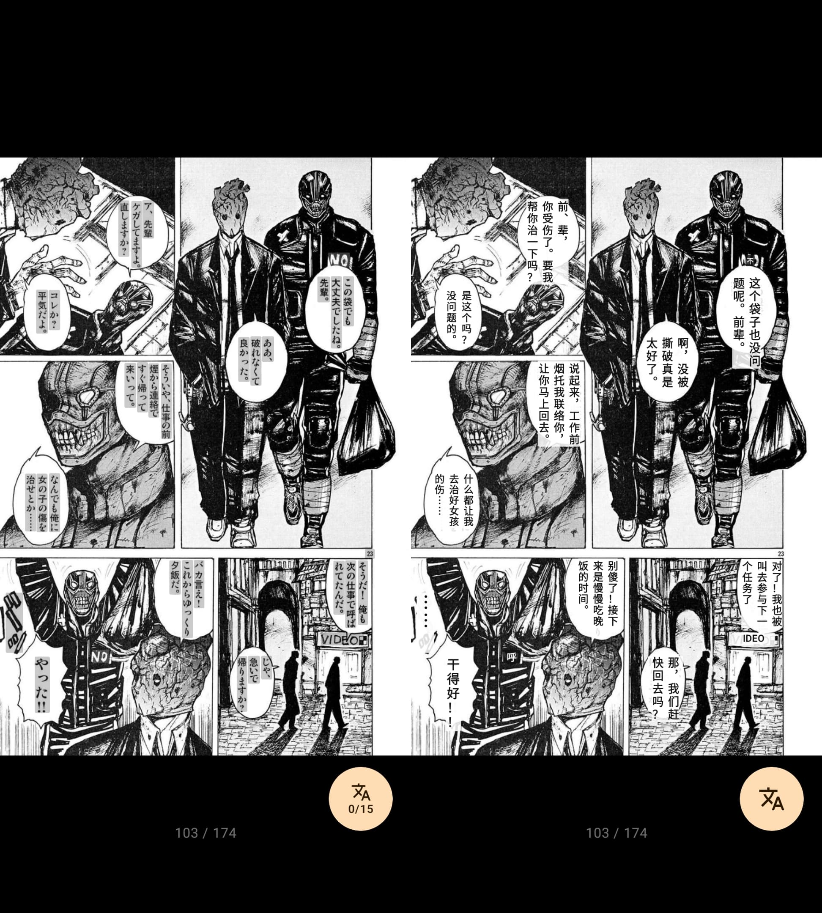

<p align="center">
  
</p>

<p align="center">
  <a href="README.md">简体中文</a> | English
</p>

# Komgarot

Komgarot is an Android comic reader client for Komga servers, built with Kotlin and Jetpack Compose.

> Feel free to open issues with feature requests. I do not use every Komga feature myself, so I may not have planned them from the start.

## Features

- Log in to the Komga server
- Browse libraries, series, collections, and reading lists
- Series search, author search, sorting, and filtering
- Book details, metadata viewing and editing
- Paged reading, scroll reading, reading direction, page fit, and progress jumping
- AI translation: After locally identifying text positions, it sends the full image and screenshots of the text block locations to the AI for translation
- Long press a page to save, share, or set as a book or series cover
- Privacy reading, app lock, and keep screen on
- Administrator portal: Libraries, users, server settings, maintenance, and activity

## Screenshots

<p>
  
  
  
  
  
  
  
</p>

## AI Translation
> Currently, this is mainly aimed at Japanese manga.
>
> This feature requires users to provide their own OpenAI-compatible AI service, and a model that supports vision must be used. **Please note, this feature will consume a large number of tokens.**
>
> Generation speed and results vary depending on the model. If the images and text contain content that violates the model provider's policies, it may result in a failure to return translation results, so please choose at your own discretion. Serial translation is the default, translating only one sentence at a time. If you find the speed too slow, you can switch to parallel in the settings. Please note that AI providers may limit the number of concurrent requests.
>
> For the sake of speed and quality, the AI translation opts for **one request per sentence of text**. The request includes the dialogue content and the complete image, therefore translating a single image will result in high consumption; sometimes there will be caching.
>
> (Personal average is 1700~2000 tokens per single request, and an average of 10k+ tokens per image)


### Translation Preview
<p></p>
<p></p>
<p></p>

## Environment

- Android 11+
- A reachable Komga server
- JDK 11+
- Android Studio or a Gradle command-line environment

## Build

Debug APK:

```powershell
.\gradlew.bat :app:assembleDebug
```

Unit tests:

```powershell
.\gradlew.bat testDebugUnitTest
```

Lint:

```powershell
.\gradlew.bat :app:lintDebug
```

Release APK:

```powershell
.\gradlew.bat :app:assembleRelease
```

Debug output:

```text
app/build/outputs/apk/debug/
```

## Technology Stack

- Kotlin
- Jetpack Compose
- Retrofit + Gson
- OkHttp
- Coil
- ONNX Runtime Android

## Acknowledgements
[hgmzhn/manga-translator-ui](https://github.com/hgmzhn/manga-translator-ui)

[jobobby04/tachiyomisy](https://github.com/jobobby04/tachiyomisy)

[FooIBar/EhViewer](https://github.com/FooIBar/EhViewer)

## Friend Links
[LINUX DO](https://linux.do)
