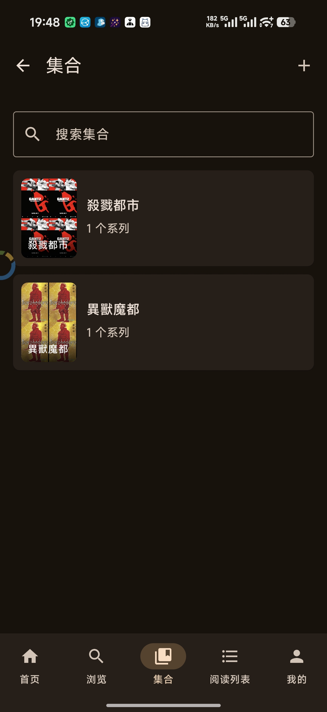
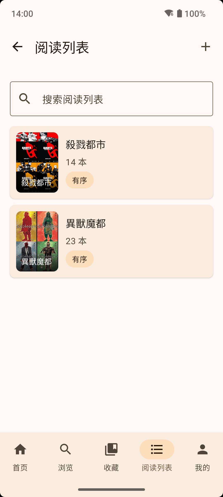
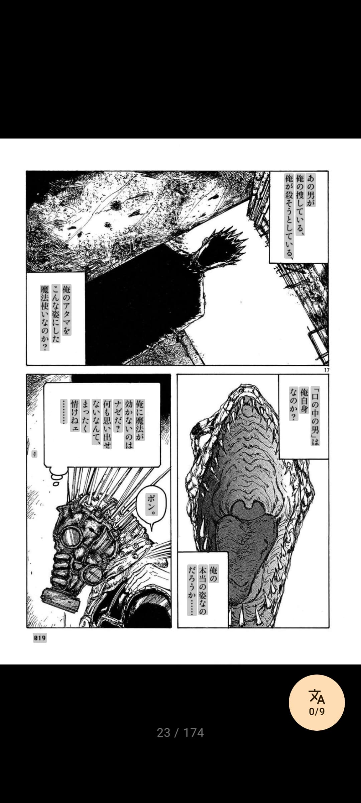
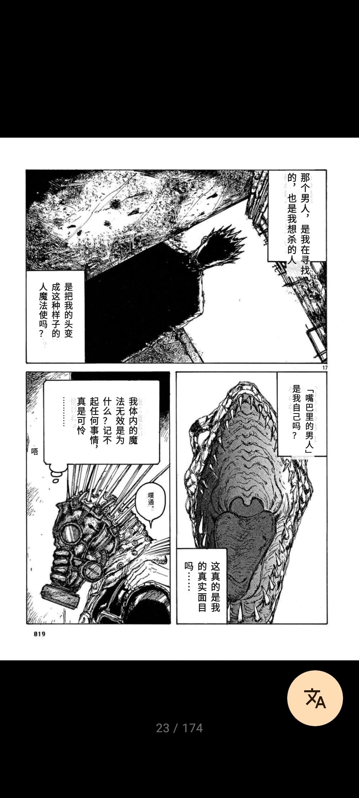
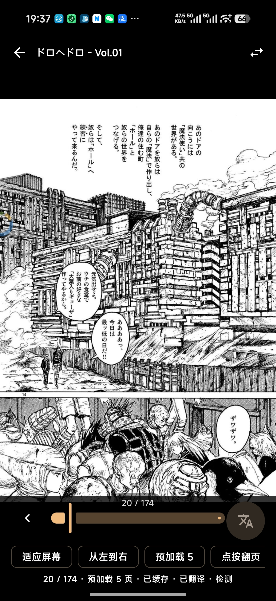
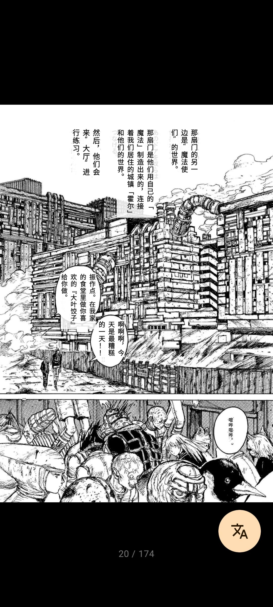
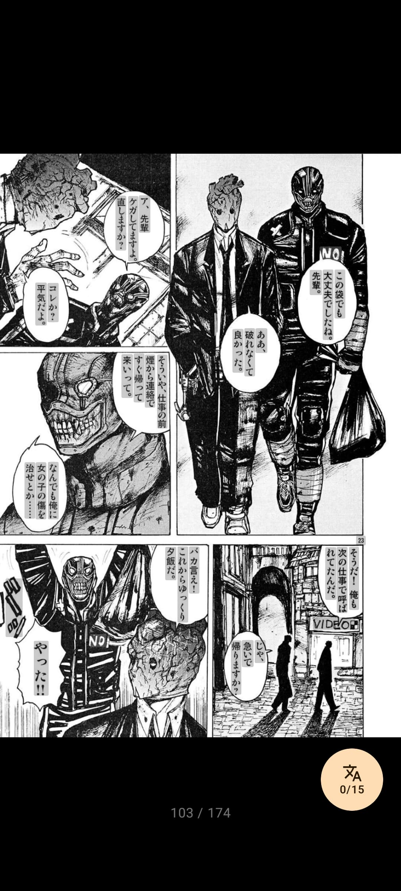
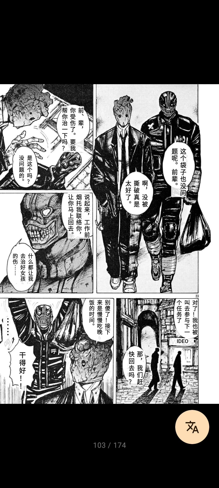

<p align="center">
  
</p>

<p align="center">
  简体中文 | <a href="README.en-US.md">English</a>
</p>

# Komgarot

Komgarot 是一个面向 Komga 服务器的 Android 漫画阅读客户端，使用 Kotlin 与 Jetpack Compose 构建。

> 欢迎在 issues 里提需求，因为我自己用 Komga 的时候很多功能也不会用到，最开始就不会考虑做

## 功能

- 登录 Komga 服务器
- 浏览书库、系列、收藏、阅读列表
- 系列搜索、作者搜索、排序、筛选
- 书籍详情、元数据查看与编辑
- 分页阅读、滚动阅读、阅读方向、页面适配、进度跳转
- AI 翻译：本地识别文本位置后，携带全图和文本块位置内容截图发送给 AI 进行翻译
- 长按页面保存、分享、设置为书籍或系列封面
- 隐私阅读、应用锁、保持亮屏
- 管理员入口：书库、用户、服务器设置、维护、活动

## 截图

<p>
  
  
  
  
  
  
  
</p>

## AI 翻译
> 目前只主要针对日漫
> 
> 此功能需要用户自己准备 OpenAI 兼容的 AI 服务，且需使用支持视觉的模型。**注意，此功能会消耗大量 Token。**
>
> 生成速度和效果随模型而异，如果图片和文本包含违反模型提供商政策的内容，可能导致其无法返回翻译结果，请自行选择。默认串行翻译，一次只翻译一句话，若嫌速度慢可以在设置里换到并行。请注意 AI 提供商可能会限制并发数量。
>
> 为了速度和质量考虑，AI 翻译选择了**每一句文本一次请求**，请求中带有对话内容和完整图片，因此翻译一张图会产生较多消耗，有时候会有缓存
>
> （个人平均单次请求 1700~2000 Token，一张图平均 1w+ Token）

### 翻译效果预览
<p>
  
  
  
  
  
  
</p>

## 环境

- Android 11+
- 可访问的 Komga 服务器
- JDK 11+
- Android Studio 或 Gradle 命令行环境

## 构建

Debug APK：

```powershell
.\gradlew.bat :app:assembleDebug
```

单元测试：

```powershell
.\gradlew.bat testDebugUnitTest
```

Lint：

```powershell
.\gradlew.bat :app:lintDebug
```

Release APK：

```powershell
.\gradlew.bat :app:assembleRelease
```

Debug 产物目录：

```text
app/build/outputs/apk/debug/
```


## 技术栈

- Kotlin
- Jetpack Compose
- Material 3
- Navigation Compose
- Retrofit + Gson
- OkHttp
- Coil
- DataStore Preferences
- AndroidX Security Crypto
- AndroidX Biometric

## 鸣谢
[hgmzhn/manga-translator-ui](https://github.com/hgmzhn/manga-translator-ui)

## 友链
[LINUX DO](https://linux.do)
