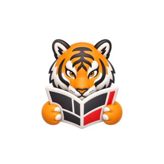
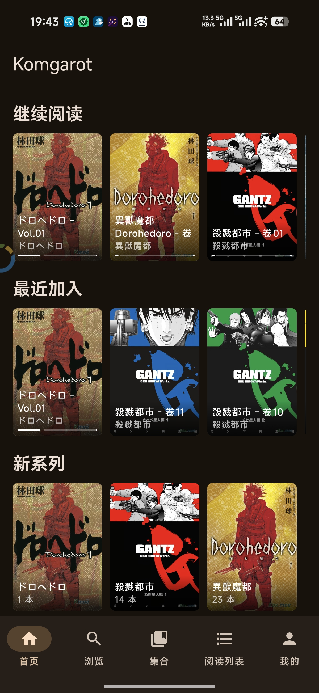
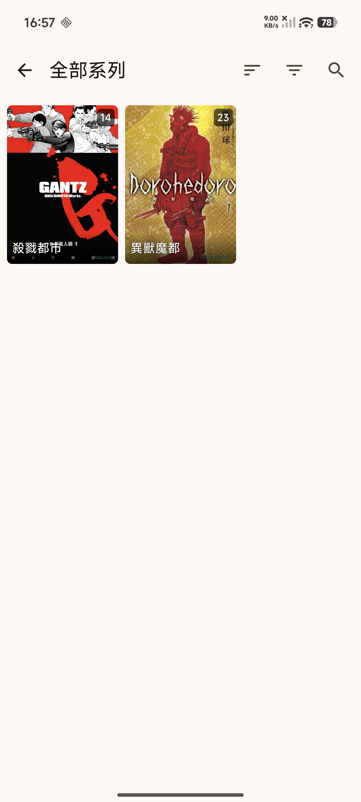
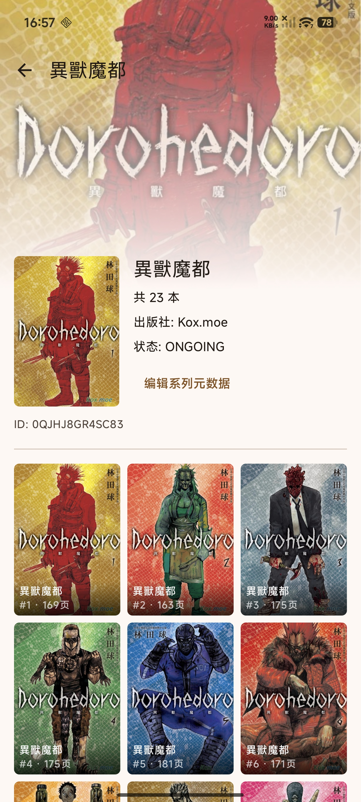
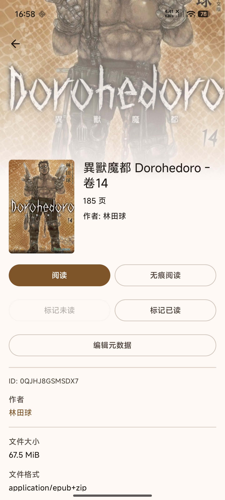

<p align="center">
  
</p>

<p align="center">
  简体中文 | <a href="README.en-US.md">English</a>
</p>

# Komgarot

Komgarot 是一个面向 Komga 服务器的 Android 漫画阅读客户端，使用 Kotlin 与 Jetpack Compose 构建。

> 本项目完全由 AI 编写，唯一一份有人类参与编写的只有 README.md

> 欢迎在 issues 里提需求，因为我自己用 Komga 的时候很多功能也不会用到，最开始就不会考虑做

## 功能

- 登录自建 Komga 服务器
- 浏览书库、系列、集合、阅读列表
- 首页展示继续阅读、最近加入、最近更新、新系列
- 系列搜索、作者搜索、排序、筛选
- 书籍详情、元数据查看与编辑
- 分页阅读、滚动阅读、阅读方向、页面适配、进度跳转
- 首尾过渡页打开上一本或下一本
- 阅读页缓存、封面缓存、失败重试
- 长按页面保存、分享、设置为书籍或系列封面
- 隐私阅读、应用锁、保持亮屏
- 管理员入口：书库、用户、服务器设置、维护、活动

## 截图

<p>
  
  
  
  
  
</p>

## 环境

- Android 11+
- 可访问的 Komga 服务器
- JDK 11+
- Android Studio 或 Gradle 命令行环境

## 构建

Debug APK：

```powershell
.\gradlew.bat :app:assembleDebug
```

单元测试：

```powershell
.\gradlew.bat testDebugUnitTest
```

Lint：

```powershell
.\gradlew.bat :app:lintDebug
```

Release APK：

```powershell
.\gradlew.bat :app:assembleRelease
```

Debug 产物目录：

```text
app/build/outputs/apk/debug/
```

## 使用

1. 启动应用。
2. 输入 Komga 地址，例如 `https://komga.example.com`。
3. 输入账号和密码。
4. 登录后选择书库、系列或书籍开始阅读。

服务器地址和登录凭据保存在设备本地。凭据使用 Android 加密存储，图片与阅读页缓存保存在应用缓存目录，可在设置页清除。

## 技术栈

- Kotlin
- Jetpack Compose
- Material 3
- Navigation Compose
- Retrofit + Gson
- OkHttp
- Coil
- DataStore Preferences
- AndroidX Security Crypto
- AndroidX Biometric

## 目录

```text
app/src/main/java/fail/tiger/komgarot
├── data        # 本地存储、API、仓库
├── ui          # 页面、组件、导航、阅读器
└── KomgarotApp.kt
```
