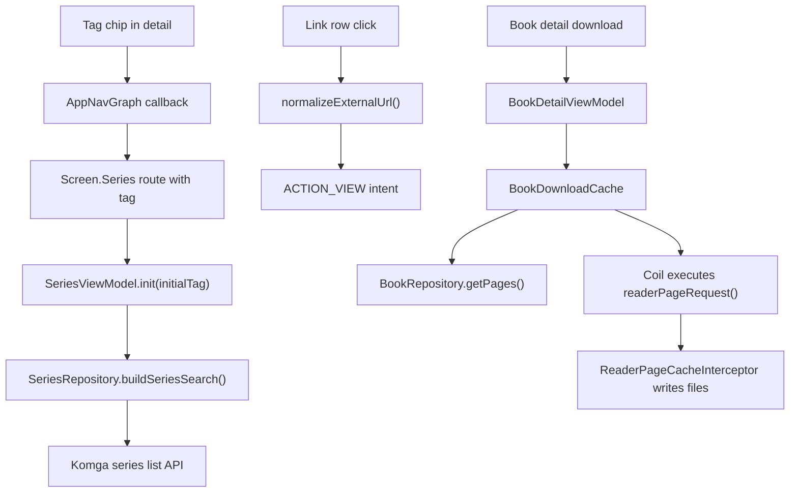

# Links, Tags, and Offline Cache Design

## Context

Issues #3, #4, and #5 request three related browsing improvements:

- Tags shown in details should be actionable and help users filter content.
- Komga metadata links should be visible and openable.
- Books should be cacheable so they remain useful as an offline index and readable content.

The existing app already has these foundations:

- `SeriesFilters(tag = ...)` and `buildSeriesSearch()` can filter series by tag.
- `BookMetadataDto` and `SeriesMetadataDto` already expose `links: List<WebLinkDto>`.
- `ReaderPageCache`, `readerPageRequest()`, and `ReaderPageCacheInterceptor` already support persistent reader page files.
- Coil disk cache already stores thumbnails under stable cache keys.

## Goals

1. Make series and book tags clickable from detail surfaces.
2. Open Komga metadata links through Android external intents.
3. Add a book-level download action that caches the book pages and thumbnail for offline reading.
4. Keep the implementation small and aligned with the current Compose/ViewModel/repository structure.

## Scope

This implementation covers:

- Series detail header tags in `BookScreen`.
- Book detail tags and links in `BookDetailScreen`.
- Metadata read-only links in `MetadataScreen`.
- Navigation from a clicked tag to the series browser with a tag filter applied.
- A download/cache action on book detail.
- Unit tests for URL normalization, search filter construction, and download state/progress helpers.

This implementation treats the existing reader page cache as the offline content store. A full offline library database, background sync queue, and system notification download manager are outside this issue batch.

## Architecture

### Tag Navigation

Add an optional `initialTag` parameter to `SeriesScreen` and the `Screen.Series` route. `SeriesViewModel.init()` will accept this tag and apply it as `SeriesFilters(tag = value)` before loading the first page.

Detail screens will receive an `onTagClick: (String) -> Unit` callback. The navigation layer will route tag clicks to `Screen.Series.go(libraryId = null, tag = tag)` so users land in the global series list filtered by that tag.

### Link Opening

Create a small URL helper in the metadata UI area:

- Trim whitespace.
- Accept `http://`, `https://`, and other valid URI schemes.
- Prefix values without a scheme with `https://`.
- Return `null` for blank values.

Display `WebLinkDto` as compact rows or assist chips using the label when present and the URL as fallback text. Clicking uses `Intent(Intent.ACTION_VIEW, Uri.parse(normalizedUrl))`. Failures show the existing generic operation-failed string.

### Book Download Cache

Add a `BookDownloadCache` helper that performs the cache work:

1. Load `BookDto` if the detail screen has not already loaded it.
2. Load `PageDto` list for the book.
3. Build page URLs with the same direct-image conversion rule used by `ReaderViewModel`.
4. For each missing page, execute `readerPageRequest()` through Coil so the existing interceptor writes into `ReaderPageCache`.
5. Execute a thumbnail image request with the existing stable thumbnail cache key.
6. Report progress as `completedPages / totalPages`.

`BookDetailViewModel` owns download UI state:

- `idle`
- `downloading(completedPages, totalPages)`
- `cached(totalPages)`
- `failed(message)`

The UI exposes this state through a tonal button near the read actions. The button is disabled during active downloads, shows progress while running, and allows retry after failure.

### Data Flow

## Error Handling

- Blank metadata URLs are not rendered as clickable targets.
- Malformed or unhandled link intents show a short failure Toast.
- Download failures keep any pages already cached and surface a retryable failed state.
- Pull-to-refresh and image invalidation continue to clear relevant caches through existing invalidators.

## Testing

Unit tests will cover:

- `normalizeExternalUrl()` trims values, preserves existing schemes, prefixes host-like values, and rejects blanks.
- `buildSeriesSearch()` emits the expected `tag` series condition.
- Download progress state helper renders completed, cached, and failed states predictably.
- Existing reader page request and cache tests remain green.

Manual verification will include:

- Open book detail with links and tags.
- Click a tag and confirm the series list loads with the tag filter.
- Click a link and confirm Android dispatches an external URL intent.
- Tap download on a book and confirm cached status reaches all pages.
